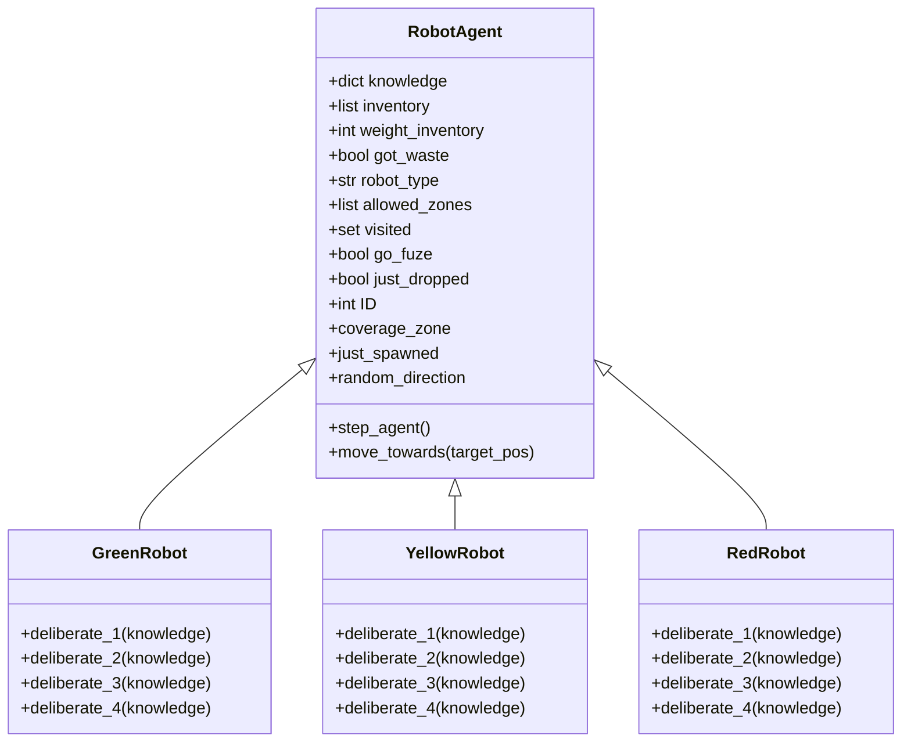
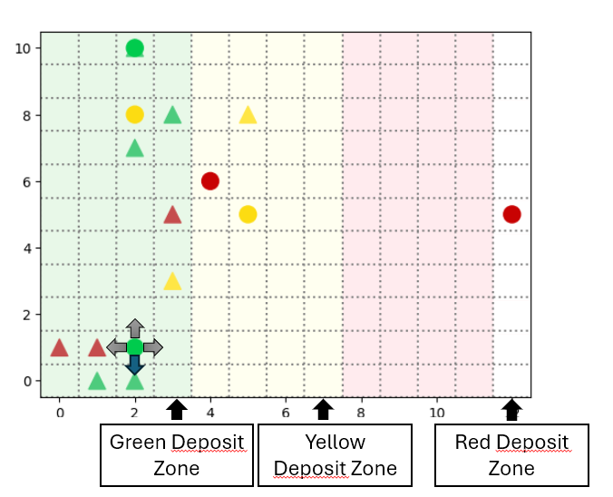
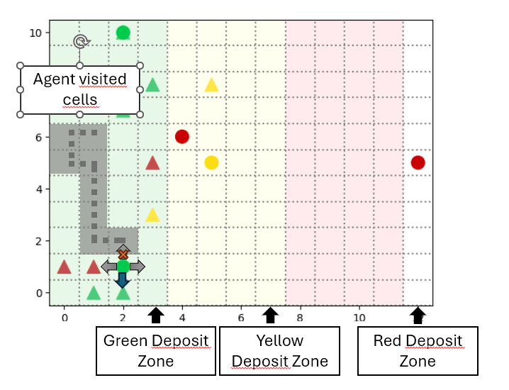
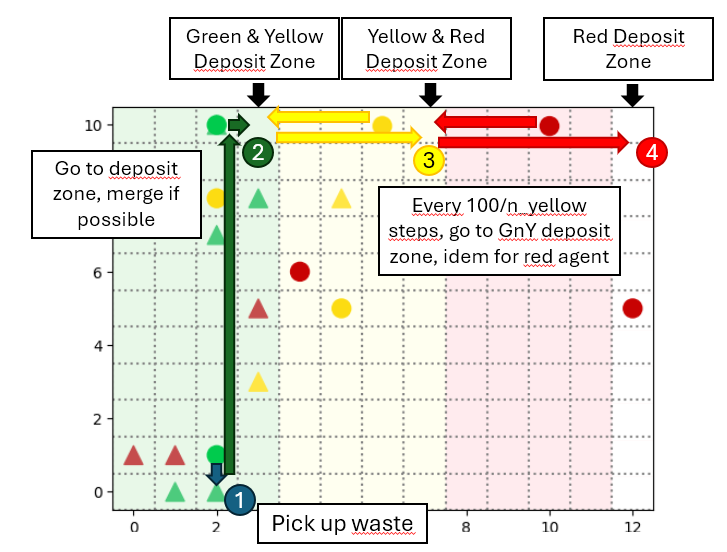
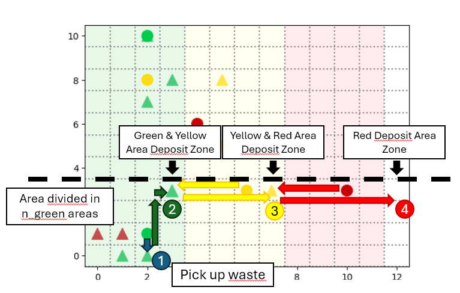
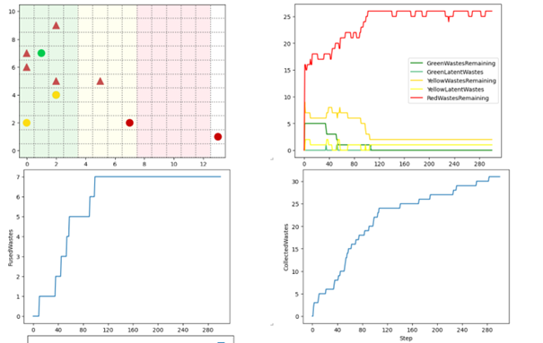
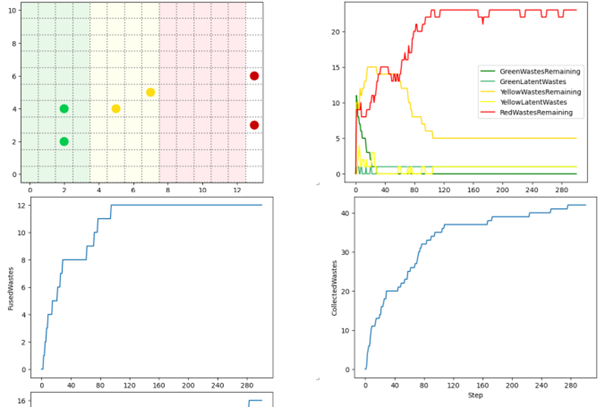
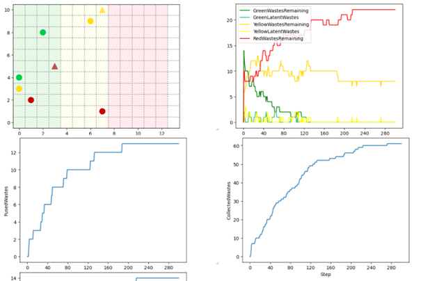
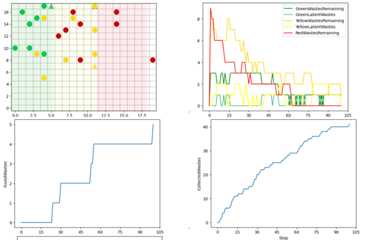

# Multi-Agents Systems
## Self-organization of robots in a hostile environment
*# robot_mission_15*

The goal of this project is to create differents agents in an environment that are able to clear 3 areas of various radioactivity levels filled with nuclear wastes.

*Group 15*
- Erwan DAVID
- Guillaume FAYNOT

## Requirements

Install the requirements in the file [`requirements.txt`]('./requirements.txt')

## Run the simulation environment

`python -m solara run server.py`

## Table of contents

1. Introduction
2. Agents
3. Model
4. Objects
5. Server
6. Strategies
7. Performance comparaison

### 1. Introduction

Through this project, we model the mission of robots that have to collect dangerous waste, transform it according to some rules and then transport it to a secure area. The robots navigate in an environment broken down into several zones where the level of radioactivity varies from low radioactive to highly radioactive. Robots only have access to specific areas matching their radioactivity levels. 

- **Green Zone** : low radioactivity zone. Green, yellow and red wastes can spawn there
- **Yellow Zone** : medium radioactivity zone. Yellow and red wastes can spawn there
- **Red Zone** : high radioactivity zone. Only red wastes can spawn there.

The goal of this project is to create a cleanup multi-agents model with the most efficient strategy to clear all the radioactive wastes in all 3 zones.

### 2. Agents

The most important class of agents eis the one that implements the Cleaning Agents behaviors. There are 3 types of robots : 

- **Green Robot** can carry 2 green wastes or 1 yellow waste at a time. Once it has picked up 2 green wastes, it merges them into 1 yellow waste. It can only move into the green zone.
- **Yellow Robot** can carry 2 yellow wastes or 1 red waste at a time. Once has picked up 2 yellow wastes, it merges them into 1 red waste. It can only move into the green and yellow zones.
- **Red Robot** can carry only 1 red waste at a time and and aims to put it in the red deposit zone. It can move into all zones.

The diagram below explains te architecture of the `RobotAgent` class

As a first approach, the agents only have a few features and caracteristics: they move randomly into their allocated areas, skipping the cells they have already visited and choosing in priority the cells that contain a wast of their type. They can pick up to two wastes, merge them, and move towards their allocated deposit zone. 

Attributes that are common for every agents are implemented in the `RobotAgent` class, and specific behaviors based are implemented in each robot's type class and differs on the startegy.

**Attributes**
- `knowledge` -> environment of the agent
- `inventory` -> wastes that the agent carries
- `weight_inventory` -> counts the wastes that have been carried
- `visited` -> cell that have previously been visited
- `allowed_zones` -> unoccupied zones in the agent's environment

allow each robot to track its environment, carried waste, and movement restrictions.

**Methods** such as `step_agent` control the robot's behavior at each simulation step, deciding on actions based on a strategy (`deliberate_1`, `deliberate_2`, `deliberate_3`, `deliberate_4`). Movement is managed with `move_towards`, and robots decide to pick up or drop waste according to their perceptions and inventory status.

The four `deliberate` methods represent different exploration strategies and will be detailed further on: no visited exploration (`deliberate_1`), exploration with a list of visited cells (`deliberate_2`), a systematic "one-by-one" exploration (`deliberate_3`), a systematic "one-by-one" spacially divided exploration (`deliberate_4`).

### 3. Model

The model is mainly repsonsible for the environment behavior, initialization of the agents and  running of the simulation.

The model is described by :
- `width`, `height`:  width and height of the grid
- `n_green`, `n_yellow`, `n_red`: number of robots of each type
- `n_wastes`: number of wastes
- `strategy`: index of the strategy dirving the agents behaviors.

A grid is created with the proper dimensions and divided in 3 radioactive zones. All the robots and wastes are setup accordingly. We use a `DataCollector` to collect the data that is being used in further analysis of the simulation. We especially focus on the count of the remaining wastes and the total number of wastes collected.

At each step, the robot agents perform different tasks: 
- get the neighbor cells contents
- decide to move on a neighbor cell or collect a waste if possible
- merge wastes if 2 wastes are picked up, then move towards the deposit zone until it's reached.

Agents aren't allowed to communicate and only percieve their surrounding environment. The main goal for the agents here is to execute random moves, avoiding a cell that was just previously occupied by another robot or previously occupied by the robot itself.

We chose not to implement communication capabilities for the agents for multiple reasons : 
- few behavior possibilities 
- communication is only usefull to allow fluid behaviors which is not crucial here. For example, using a master agent does not require communication capabilities apport declaring its behavior to the others
- spacial segmentation seems more promissing considering the size of of the grid : some agents are dedicated to a part of an area instead of using a "first come - first served strategy"

### 4. Environment Objects

The environment objects are represented as agents to meet the Mesa library constraints. These agents do not have a proper behavior whatsoever, but it allows the environment to identify particular characteristics.

- **Waste** : this agent represents a waste to collect. Its main attribute is its type (green, yellow or red)

- **Radioactivity** : this agent represents the radioactivity of a zone. Its attributes are its zone ID (1 -> green, 2 -> yellow, etc) and its radioactivity level (green -> [0, 0.33], yellow -> [0.33, 0.66], red -> [0.66, 1]).

- **WasteDisposalZone** : this agent represents the waste disposal zone at the end of each zone

### 5. Server

By running server.py, a visulization window opens, allowing to see the simulation on a grid and a few plots : 

- RemainingWastes : counts the remaining wastes for each type.
- FusedWastes : counts all the wastes that have been merged, independently on the type.
- CollectedWastes : counts all the wastes that have been collected, independently on the type.
- RedWastesDeposit : counts all the red wastes that have been deposited.

### 6. Strategies

For this first iteration, we implemented 3 differents strategies, which can be changed using the corresponding cursor on the server web page.

- **Strategy 1**: agents move totally randomly in their allowed area and try to get a waste. When exactly two wastes are collected, they move towards the deposit zone on the far right and drop a merge waste of another color

- **Strategy 2**: agents move randomly in their allowed area, directy going to a corresponding waste in their neighborhood (if its inventory isn't full) or avoiding the areas it has already visited, and try to get a waste. When exactly two wastes are collected, they move towards the deposit zone on the far right and drop a merge waste of another color.

- **Strategy 3**: agents move randomly in their allowed area, directy going to a corresponding waste in their neighborhood (if its inventory isn't full) or avoiding the areas it has already visited, and try to get a waste. To avoid any latent waste (for example, an agent that has picked up a waste but can't find another one to merge), each agent goes to an intermediate desposit zone (1 cell) and drops the single waste he has. If a waste is already in the deposit zone, he picks up two wastes and merges them. The he goes to the deposit zone of the next color. Note : to optimize displacement of the agents, deposit zone for agents green and yellow are the same.

- **Strategy 4**: It's the same as the strategy 3 except that the space is vertically equally divided among the differents bots. For this strategy to work properly, there should be an equal number of bots in each area. This strategy speeds up waste collection, as no robot has to scour the entire map from top to bottom to deposit its waste. But a problem arises when there are 2 items of the same color in 2 different deposit zones. In order for these wastes to be merged one day, the robots will switch from strategy 4 to 3 after a certain period of time. They change strategy when they have made a certain number of random moves (this means that all, or almost all, zones have been visited, and the game is well advanced).

### 7.Performance Comparaison

Ou objective is to build agents that can collect the most wastes as possible in the minimum amount of time.

Here are a performance plot for each strategy, with the same parameters (2 agents of each type and 15 random wastes).

Parameters are fixed as following:

- Grid size: 20x18
- Number of green agents: 8
- Number of yellow agents: 8
- Number of red agents: 8
- Initial wastes: 20

**Strategy 1**

**Strategy 2**

**Strategy 3**

**Strategy 4**

**Comparison Table**

The table below compares the number of steps needed to completely clear the environment of the red wastes (already there + merged) on 10 simulations.

| Strategy   | Mean | Median | Variance |
|------------|------|--------|----------|
| Strategy 1 | 326  | 265    | 219      |
| Strategy 2 | 92   | 93     | 31       |
| Strategy 3 | 161  | 100    | 134      |
| Strategy 4 | 127  | 112    | 63       |

The main drawback of strategies 1 and 2 are the latent wastes: once the agent has picked up a waste, he is unable to find an other one to complete the pair and merge. Strategy 2 overall much more efficient.

To avoid this issue, we decided not to use communication but allow a "gathering phase" where all the agents will gather to the deposit zone and drop their wastes. Hence all the wastes will be merged pairwise (allthough there might be an uneven number of wastes). This behavior is implemented in strategies 3 and 4. Eventhough it is less efficient, it is a more efficient behavior and strategy 4 especcially performs well, compared to strategy 2.